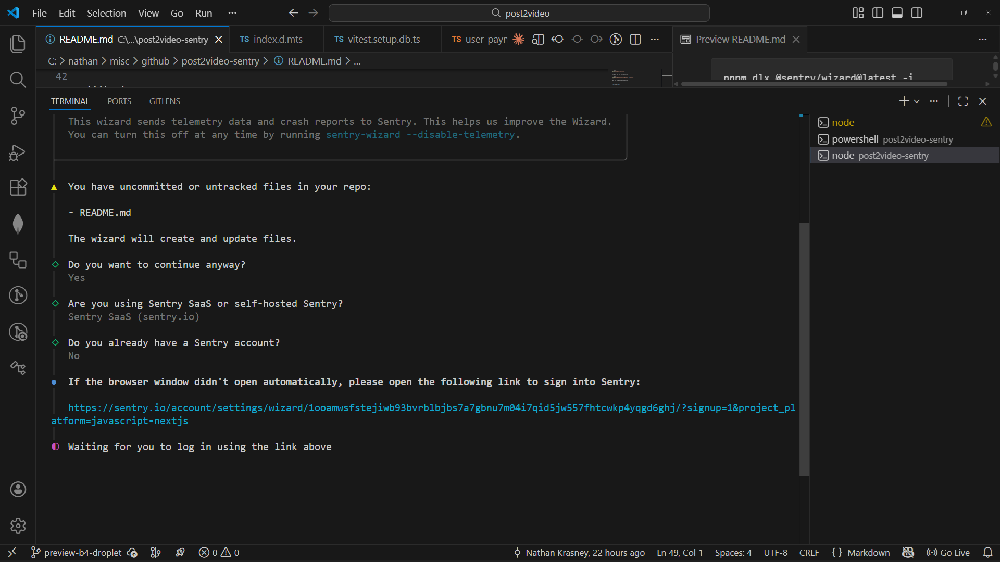
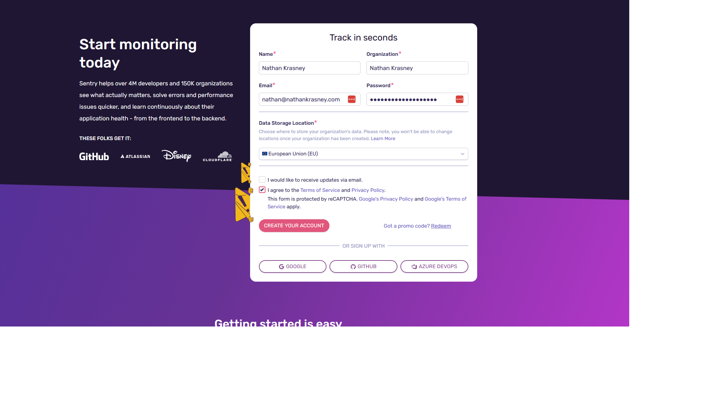
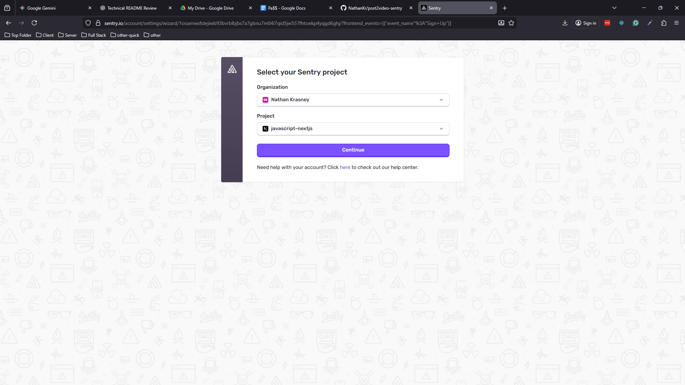
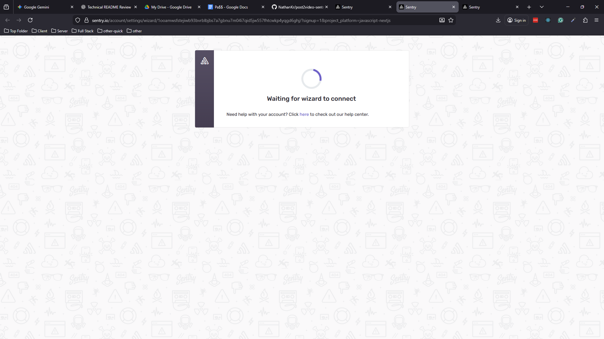
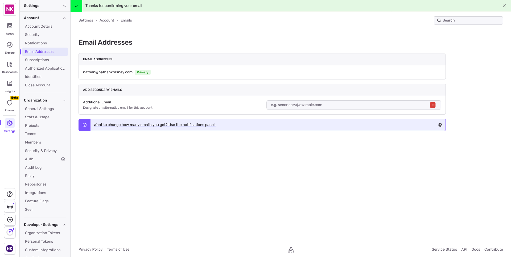
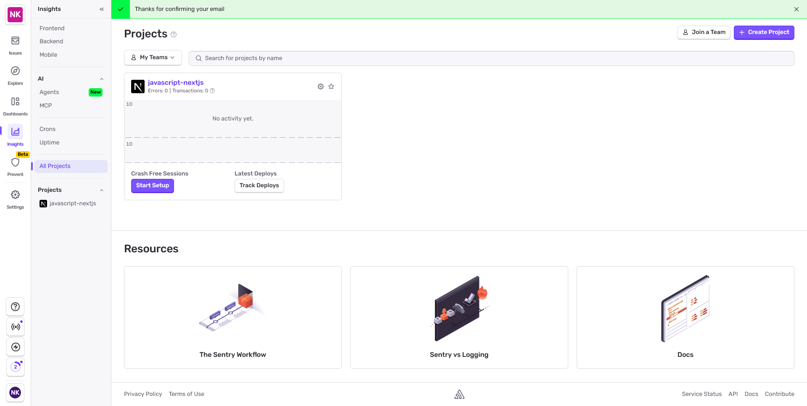

<h1>Project Name</h1>
  Next.js + Sentry: Production Error Monitoring for Post2Video


<h2>Project Description</h2>
Building production error alerts for a Next.js micro-SaaS: how I evaluated and integrated Sentry for real-time error awareness. Includes the working demo I used to test the integration before deploying it to Post2Video.


<h2>Motivation</h2>

<p>
A user successfully signed up on post2video.com but failed onboarding due to a production error.
The error was logged, but no alert was triggered — so I didn’t know about it.
</p>

<p>
This highlighted a gap in my production setup:
logs existed, but there was no real-time error awareness.
</p>

<p>
The goal was to design a simple, free, and reliable alerting system for a Next.js micro-SaaS.
</p>


<h2>Key Takeaways</h2>
<ul>
    <li>...</li>
   
</ul>

<h2>Installation</h2>

Step 1: Install the Dependency

```bash
pnpm add @sentry/nextjs 
```

Step 2: Run the Initialization

```bash
pnpm dlx @sentry/wizard@latest -i nextjs
```

You are prompots for questions : 



The browser in open so fill the info



click the 'create youtr account' button and you are navigated to select yout project




Click continue  => i got 'waiting for wizard to connect'



i used email password so need to confirm email and got



Now in sentry i can see the project



but no files created . Because i chose to log in with an email/password, you had the extra step of confirming your email. This sometimes causes the browser session to "lose track" of the original terminal request. 


### 🛠️ Installation Troubleshooting: Manual CLI Initialization

If the automated Sentry wizard hangs or fails to generate local files (for example, after logging in via email/password), you can bypass the browser step using an **Auth Token**.

#### 1. Generate an Auth Token
1. Log in to your Sentry Dashboard.  
2. Navigate to **Settings → Account → API → Auth Tokens**.  
3. Click **Create New Token**.  
4. Assign the following scopes:
   - `project:write` (required to modify local config files)  
   - `org:read` (required to list your organizations)  
5. Copy the token string (it usually begins with `sntrys_`).

#### 2. Run the Wizard with the Auth Token

```bash
pnpm dlx @sentry/wizard@latest -i nextjs --auth-token YOUR_TOKEN_HERE
```


### Files Created After Successful Installation

  The Sentry wizard creates these files in your project:

  1. **`sentry.client.config.ts`** - Browser-side Sentry initialization
  2. **`sentry.server.config.ts`** - Server-side Sentry initialization
  3. **`sentry.edge.config.ts`** - Edge runtime error handling
  4. **`instrumentation.ts`** - Registers Sentry before Next.js starts (critical for server errors)
  5. **`next.config.ts`** - Modified with `withSentryConfig()` wrapper
  6. **`.env.sentry-build-plugin`** - Auth token (auto-added to `.gitignore`)

  **Note:** Files 1-4 will be in `src/` if you use that directory structure, otherwise in project root.

<h2>Usage</h2>
....


<h2>Technologies Used</h2>

- next.js
- digital ocean droplet
- ubuntu
- micro saas
- winston
- pm2 
- nginx
- UptimeRobot


## Monitoring Design

### Constraints
- Tool must be free
- Must fit existing tech stack (Next.js, DigitalOcean, Ubuntu)
- Most business logic runs on the server

### Evaluated Alerting Options
| Option | Type | Pros | Cons | Decision |
|--------|------|------|------|----------|
| Custom Alerts (Winston + Webhooks) | Self-built | Full control, no vendor lock-in | High maintenance, no error grouping, alert noise | Rejected |
| Self-hosted Error Tracker (GlitchTip) | Open-source | Full data ownership, Sentry-compatible | Requires hosting, scaling, backups | Rejected |
| Paid APM Tools (Datadog, New Relic) | SaaS | Powerful observability | Paid, overkill for micro-SaaS | Rejected |
| **Sentry** | SaaS | Free tier alerts, Next.js support, automatic grouping | Free tier: 5K events/month | **Chosen** |

**Why Sentry?** While the free tier has a 5K events/month limit, the tradeoff favors Sentry at micro-SaaS scale. Expected error volume for <100 DAU with ~1% error rate is 600-1.2K events/month (well within limits). The automatic error grouping and Next.js integration eliminate the maintenance burden of custom solutions, and no infrastructure management beats self-hosted options for a solo developer.

### Error Monitoring Strategy

**Approach:** Layered error detection – complementary defenses

| Layer | Tool | Role (Real) | Can Alert on Error? |
|-------|------|-------------|---------------------|
| **Application** | **Sentry SDK** | Alerts on: (1) thrown exceptions, (2) errors explicitly sent via SDK | **Yes – via Sentry alert rules** |
| **Application (handled)** | Your code + Winston | Logs all errors, but requires webhook for alerts | No, unless **you build webhook** |      
| **Process** | **PM2** | Detect crash/OOM | Limited / usually custom script |

**Note:** Server availability monitored separately via Uptime Robot.


<h2>Code Structure</h2>
....

<h2>Demo</h2>
....

<h2>Points of Interest</h2>
<ul>
    <li>...</li>
   
</ul>

<h2>References</h2>
<ul>
    <li>...</li>
   
</ul>

