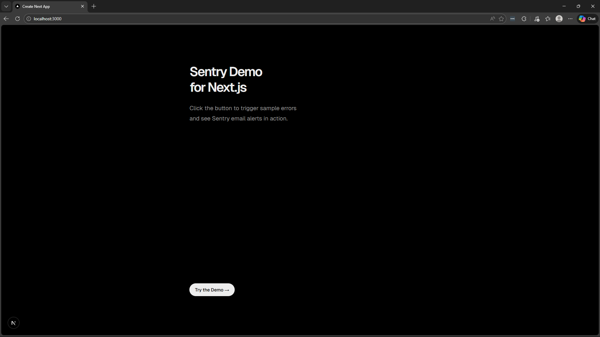
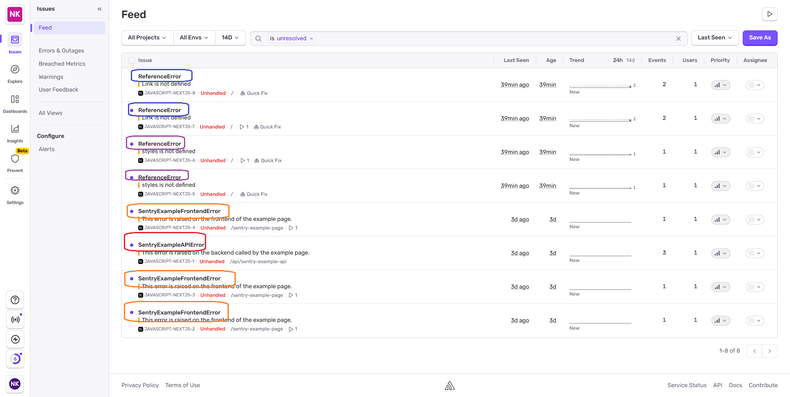
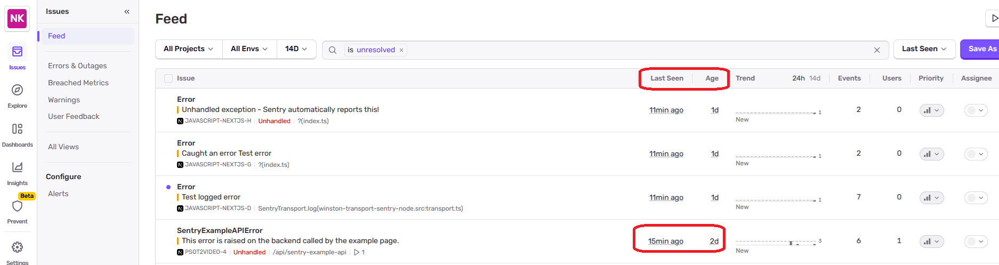

  # Project Name
    Next.js + Sentry: Production Error Monitoring for Post2Video

  ## Project Description
  Building production error alerts for a Next.js micro-SaaS: how I evaluated and integrated Sentry for real-time error awareness. Includes the working demo I used to test the integration before deploying it to Post2Video.

  ## Motivation

  A user successfully signed up on post2video.com but failed onboarding due to a production error.
  The error was logged, but no alert was triggered — so I didn’t know about it.

  This highlighted a gap in my production setup:
  logs existed, but there was no real-time error awareness.

  The goal was to design a simple, free, and reliable alerting system for a Next.js micro-SaaS.

  ## Key Takeaways

  - Sentry captures errors implicitly on client / server (unhandled exceptions) and explicitly (handled errors via SDK calls like Sentry.captureException())
  - Real-time email alerts ensure you know about production errors immediately
  - Free tier (5K events/month) is in general sufficient for micro-SaaS

  ## Installation

Step 1: Install the Dependency

```bash
pnpm add @sentry/nextjs
```

Step 2: Run the Initialization

```bash
pnpm dlx @sentry/wizard@latest -i nextjs
```

You are prompted for questions :


The browser in open so fill the info


click the 'create your account' button and you are navigated to select your project


Click continue => i got 'waiting for wizard to connect'


i used email password so need to confirm email and got


Now in sentry i can see the project


but no files created . Because i chose to log in with an email/password, you had the extra step of confirming your email. This sometimes causes the browser session to "lose track" of the original terminal request.

### 🛠️ Installation Troubleshooting: Manual CLI Initialization

If the automated Sentry wizard hangs or fails to generate local files (for example, after logging in via email/password), you can bypass the browser step using an **Auth Token**.

### 1. Generate an Auth Token

1. Log in to [Sentry.io](https://sentry.io/).
2. Click **Settings** (gear icon) in the left sidebar.
3. Under the **Developer Settings** section, click **Organization Tokens**.
4. Click **Create New Token**.
5. **Name:** Enter `post2video-cli-token`.
6. Click **Create Token** and copy the string immediately (it starts with `sntrys_`).

> **Note:** Sentry only shows the full token once for security. If you lose it, you will need to delete it and create a new one.

Step 1


Step 2


Step 3


Step 4


#### 2. Run the Wizard with the Auth Token

```bash
pnpm dlx @sentry/wizard@latest -i nextjs --auth-token YOUR_TOKEN_HERE
```

the result is
[here](./figs/run-wizrad-with-token-output.txt)

### Files Created After Successful Installation

    The Sentry wizard creates these files in your project:

    1. **`src/instrumentation-client.ts`** - Browser-side Sentry initialization
    2. **`sentry.server.config.ts`** - Server-side Sentry initialization
    3. **`sentry.edge.config.ts`** - Edge runtime error handling
    4. **`src/instrumentation.ts`** - Registers Sentry before Next.js starts (critical for server errors)
    5. **`next.config.ts`** - Modified with `withSentryConfig()` wrapper
    6. **`.env.sentry-build-plugin`** - Auth token (auto-added to `.gitignore`)

    **Note:** In this project, files #1 and #4 are in `src/`, while files #2, #3, #5, and #6 are in the project root.

### Step 3: Configure CI/CD Secrets (Production)
If you are deploying via a CI/CD pipeline (like GitHub Actions) or a remote server, you must provide the Sentry Auth Token as an environment variable. This allows the build process to upload source maps so you can see unminified code in your stack traces.

Add the following secret to your CI provider or your production `.env` file:

* **`SENTRY_AUTH_TOKEN`**: The token you generated in the "Manual CLI Initialization" step.
* **`SENTRY_ORG`**: Your Sentry organization slug.
* **`SENTRY_PROJECT`**: Your Sentry project slug.


### How to Test Installation

After installation, verify that Sentry is working correctly by testing both client-side and server-side error capture.

#### Step 1: Start the Development Server

```bash
pnpm dev
```

#### Step 2: Visit the Sentry Test Page

Navigate to the built-in test page:

```
http://localhost:3000/sentry-example-page
```

#### Step 3: Trigger Test Errors

Click the **Throw Unhandled Exception** button. This will:

- Trigger a **server-side error** via API call to `/api/sentry-example-api`
- Trigger a **client-side error** in the browser
- Send both errors to Sentry

>💡 **Expectation Check:** While this triggers **two** separate errors, Sentry’s default alert rules often group simultaneous events from the same session to prevent alert fatigue. You will likely receive **only one email alert**, even though **both** errors will appear as distinct issues in your dashboard.

#### Step 4: Verify in Sentry Dashboard

Visit your Sentry Issues page:

https://[your-org-name].sentry.io/issues/?project=[your-project-id]

e.g. https://nathan-krasney.sentry.io/issues/?project=4510673955258448


You should see 2 new error events:

- **`SentryExampleAPIError`** - Backend error (captured by `sentry.server.config.ts`)
- **`SentryExampleFrontendError`** - Frontend error (captured by `src/instrumentation-client.ts`)

#### step 5: Check Your Inbox

Verify that Sentry's Alert Engine triggered a notification.

- Check the email associated with your Sentry account.
- You should receive an email with the subject: "Regression: SentryExampleFrontendError" (or similar).

#### What to Look For

- ✅ **Errors appear in Sentry dashboard**
- ✅ **Email alert received in your Inbox**
- ✅ **Stack traces show exact file and line numbers**
- ✅ **Session Replay available** (client-side errors include user session recording)
- ✅ **Performance traces captured** (tracesSampleRate: 1 in config)


If errors appear in Sentry and your Inbox, your installation is complete and working correctly!

  
## Usage
  This section covers running the demo locally and configuring Sentry for production deployment.

### Run the Demo

**Development mode:**

```bash
  pnpm dev
```

Click the 'Throw Unhandled Exception' or 'Send Explicit Error' buttons and you'll receive an email alert from Sentry.

**Note:** The 'Send Explicit Error' button is a custom addition to this demo project to demonstrate explicit error capture with `Sentry.captureException()`. It is not part of the standard Sentry installation.

### Production-Only Configuration (Recommended for Real Apps)

By default, Sentry runs in both development and production, wasting your 5K events/month quota during local testing.

To preserve free tier events, configure Sentry to run only in production:

Wrap Sentry.init() in instrumentation-client.ts, sentry.server.config.ts, and sentry.edge.config.ts:

```typescript
if (process.env.NODE_ENV === "production") {
  Sentry.init({
    // ... your config
  });
}
```
This ensures Sentry only captures errors in your deployed production environment where NODE_ENV is set by your hosting provider.

## Troubleshooting & FAQ

### 1. "Age" vs "Last Seen" Confusion
**Issue:** I see an error with an Age of "2 days" but "Last Seen" is "2 minutes ago," yet I didn't get an email alert just now.

**Explanation:** - **Age:** The first time this specific error fingerprint was ever recorded.
- **Last Seen:** The most recent occurrence.
- **Why no email?** By default, Sentry alerts on **New Issues** (Age = 0). Since this issue was already "born" 2 days ago, Sentry considers it an ongoing event and suppresses duplicate alerts to prevent inbox fatigue.

**Solution:** If you want to be notified for every occurrence or a spike, you must configure **Alert Rules** in Sentry under `Settings > Alerts` and set a rule for "An issue is seen" rather than just "A new issue is created."

### 2. Sentry is catching errors but not sending emails
- Check your `Action Interval` in Alert Rules (default is often 30-60 minutes).
- Ensure your `NODE_ENV` is actually set to `production` if you implemented the production-only wrapper.
- Verify the `level` in `logger.ts` — if you log as `logger.warn()`, it won't be sent if your transport is set to `level: 'error'`.


## Technologies Used
    Technologies organized by system layer:

  ### Core Stack
  - **Next.js** (App Router)
  - **Micro-SaaS** (Post2Video)

  ### Infrastructure & Deployment
  - **DigitalOcean** (Ubuntu Droplet)
  - **Nginx** (Reverse Proxy)
  - **PM2** (Process Management)

  ### Monitoring & Observability
  - **Sentry** (Real-time Error Tracking & Alerting) — **[NEW]**
  - **Winston** (Structured Application Logging)
  - **UptimeRobot** (External Downtime Monitoring)


## Monitoring Design
 This section documents the constraints, evaluation process, and architectural decisions behind choosing Sentry for production error monitoring.

### Constraints

- Micro-SaaS scale (<100 DAU)
- Tool must be free
- Must fit existing tech stack (Next.js, DigitalOcean, Ubuntu)
- Most business logic runs on the server

### Evaluated Alerting Options

| Option                                | Type        | Pros                                                  | Cons                                             | Decision   |
| ------------------------------------- | ----------- | ----------------------------------------------------- | ------------------------------------------------ | ---------- |
| Custom Alerts (Winston + Webhooks)    | Self-built  | Full control, no vendor lock-in                       | High maintenance, no error grouping, alert noise | Rejected   |
| Self-hosted Error Tracker (GlitchTip) | Open-source | Full data ownership, Sentry-compatible                | Requires hosting, scaling, backups               | Rejected   |
| Paid APM Tools (Datadog, New Relic)   | SaaS        | Powerful observability                                | Paid, overkill for micro-SaaS                    | Rejected   |
| **Sentry**                            | SaaS        | Free tier alerts, Next.js support, automatic grouping | Free tier: 5K events/month                       | **Chosen** |

**Why Sentry?** While the free tier has a 5K events/month limit, the tradeoff favors Sentry at micro-SaaS scale. Expected error volume for <100 DAU with ~1% error rate is 600-1.2K events/month (well within limits). The automatic error grouping and Next.js integration eliminate the maintenance burden of custom solutions, and no infrastructure management beats self-hosted options for a solo developer.

### How Sentry Works

When an error occurs, the Sentry SDK hooks into the runtime to automatically capture the exception and its context (like stack traces and breadcrumbs), then transmits it asynchronously as a JSON payload to Sentry’s servers via a non-blocking HTTP POST request.

**Propagation Breakdown**

- **Capture**: The SDK listens for global events like window.onerror (browser) or uncaughtException (server).
- **Enrichment**: It attaches metadata such as the user's OS, browser, and the sequence of actions leading to the crash (Breadcrumbs).
- **Transport**: The data is bundled into an "Envelope" and sent to your unique DSN endpoint without slowing down your application's performance.
- **Processing**: Sentry’s cloud receives the data, applies Source Maps to make the code readable, and checks your Alert Rules to send you an email immediately.

### Error Monitoring Strategy

**Approach:** Layered error detection – complementary defenses

| Layer                     | Tool                | Role (Real)                                                          | Can Alert on Error?              |
| ------------------------- | ------------------- | -------------------------------------------------------------------- | -------------------------------- |
| **Application**           | **Sentry SDK**      | Alerts on: (1) thrown exceptions, (2) errors explicitly sent via SDK | **Yes – via Sentry alert rules** |
| **Application (handled)** | Your code + Winston | Logs all errors, but requires webhook for alerts                     | No, unless **you build webhook** |
| **Process**               | **PM2**             | Detect crash/OOM                                                     | Limited / usually custom script  |

**Note:** Server availability monitored separately via Uptime Robot.

## Code Structure

> 💡 **Note:** The standard Sentry installation includes `Sentry.logger` and `Sentry.startSpan` in the example code. This demo has removed them to focus exclusively on error capture and alerting.

  ### Sentry API Usage Explained

To provide deeper observability beyond just "catching crashes," the following Sentry APIs are utilized in this implementation:

- **`Sentry.captureException`**: Used for **Explicit Error Tracking**. This is essential for reporting errors that occur inside `try/catch` blocks or business logic where the application doesn't necessarily "crash," but the error state still needs to be recorded.
  
 ### API Endpoint (Server-Side)
  Demonstrates Sentry **automatically reporting** a crash that occurs in the server.

  ```typescript
import * as Sentry from "@sentry/nextjs";
export const dynamic = "force-dynamic";

class SentryExampleAPIError extends Error {
  constructor(message: string | undefined) {
    super(message);
    this.name = "SentryExampleAPIError";
  }
}

// A faulty API route to test Sentry's error monitoring
export function GET() {
  // --- Sentry example API called
  throw new SentryExampleAPIError(
    "This error is raised on the backend called by the example page.",
  );
}
  ```

  ### Throw Unhandled Exception Button (Client-Side)
  Demonstrates Sentry **automatically reporting** a crash that occurs in the browser.

  ```typescript
      <button
        type="button"
        onClick={async () => {
          // --- User clicked unhandled exception button
          const res = await fetch("/api/sentry-example-api");
          if (!res.ok) {
            setHasSentError(true);
          }
          throw new SentryExampleFrontendError(
            "Unhandled exception on frontend"
          );
        }}
        disabled={!isConnected}
      >
        <span>Throw Unhandled Exception</span>
      </button>
  ```

### Send Explicit Error Button (Manual Capture)
Demonstrates manual error reporting using Sentry.captureException.

```typescript
   <button
    type="button"
    onClick={async () => {
      // --- User clicked explicit error button
      Sentry.captureException(
        new Error("Explicit error captured via SDK")
      );
      setHasSentError(true);
    }}
    disabled={!isConnected}
  >
    <span>Send Explicit Error</span>
  </button>
```

## Demo
  Visual walkthrough from triggering test errors to receiving Sentry alerts.

  home page
  


sentry page after click button Throw Unhandled Exception


alert email from sentry following button click


sentry alerts as result of un handled exception

- red : sentry api error
- orange : sentry front end error
- blue : link not defined error
- purple : style not defined error




age vs last seen 


## References

- [Sentry for Next.js SDK Docs](https://docs.sentry.io/platforms/javascript/guides/nextjs/)
