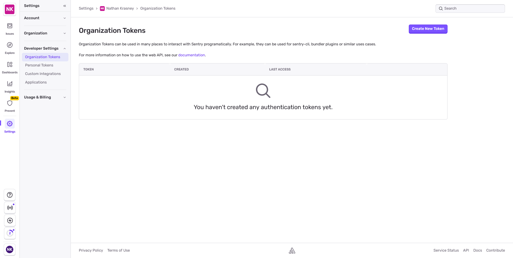
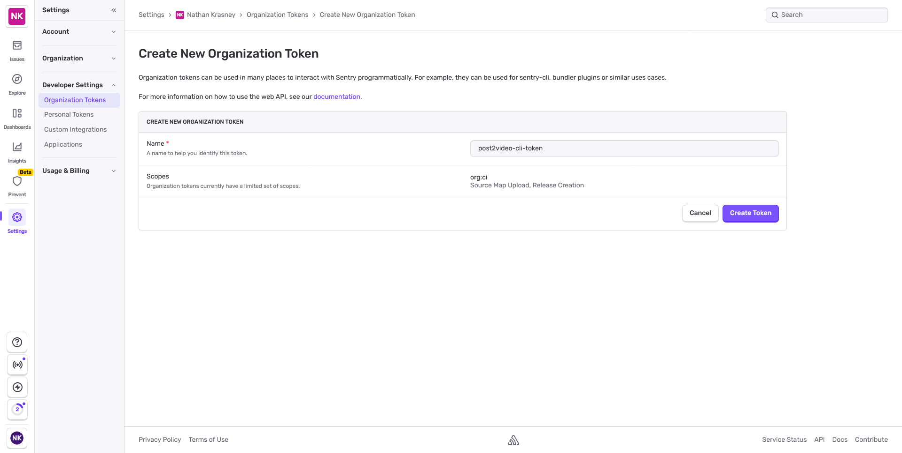
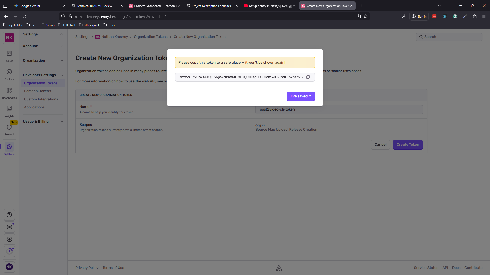
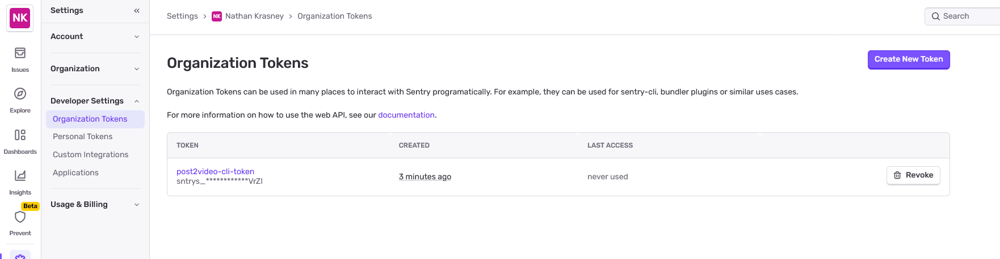
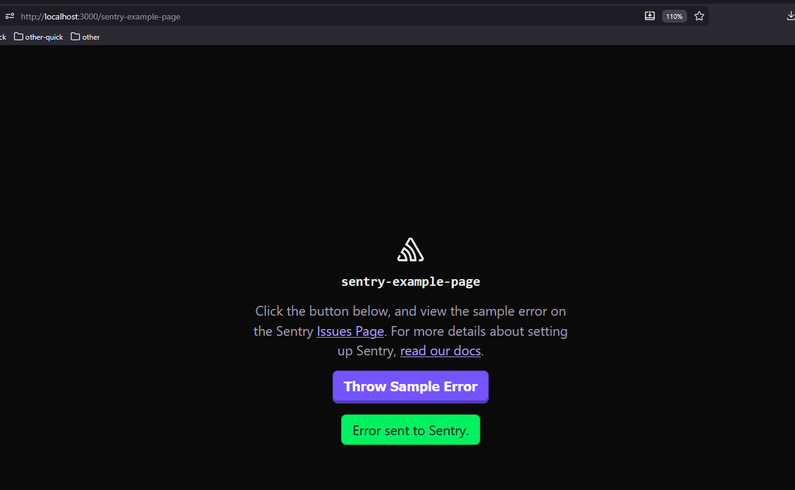
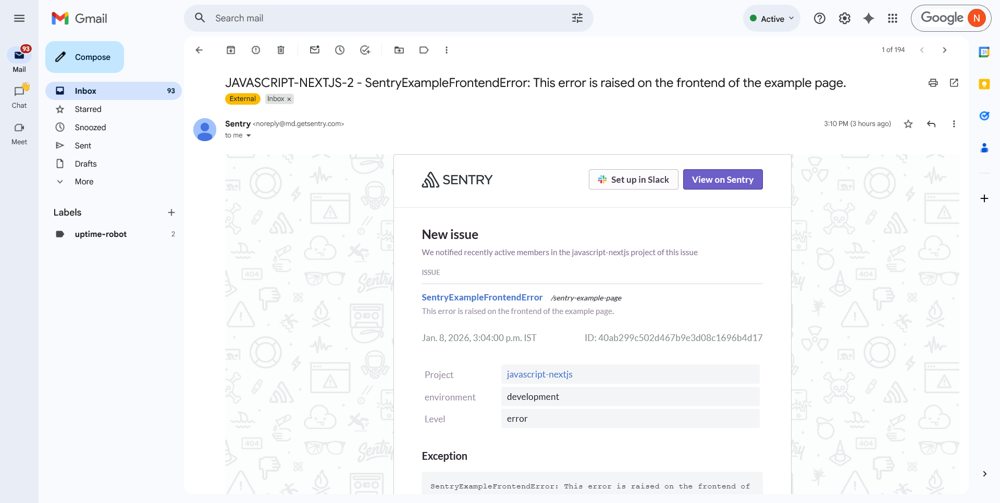

  <h1>Project Name</h1>
    Next.js + Sentry: Production Error Monitoring for Post2Video


  <h2>Project Description</h2>
  Building production error alerts for a Next.js micro-SaaS: how I evaluated and integrated Sentry for real-time error awareness. Includes the working demo I used to test the integration before deploying it to Post2Video.


  <h2>Motivation</h2>

  <p>
  A user successfully signed up on post2video.com but failed onboarding due to a production error.
  The error was logged, but no alert was triggered — so I didn’t know about it.
  </p>

  <p>
  This highlighted a gap in my production setup:
  logs existed, but there was no real-time error awareness.
  </p>

  <p>
  The goal was to design a simple, free, and reliable alerting system for a Next.js micro-SaaS.
  </p>


  <h2>Key Takeaways</h2>
  <ul>
      <li>...</li>
    
  </ul>

  <h2>Installation</h2>

  Step 1: Install the Dependency

  ```bash
  pnpm add @sentry/nextjs 
  ```

  Step 2: Run the Initialization

  ```bash
  pnpm dlx @sentry/wizard@latest -i nextjs
  ```

  You are prompots for questions : 

  

  The browser in open so fill the info

  

  click the 'create youtr account' button and you are navigated to select yout project

  


  Click continue  => i got 'waiting for wizard to connect'

  

  i used email password so need to confirm email and got

  

  Now in sentry i can see the project

  

  but no files created . Because i chose to log in with an email/password, you had the extra step of confirming your email. This sometimes causes the browser session to "lose track" of the original terminal request. 


  ### 🛠️ Installation Troubleshooting: Manual CLI Initialization

  If the automated Sentry wizard hangs or fails to generate local files (for example, after logging in via email/password), you can bypass the browser step using an **Auth Token**.

  ### 1. Generate an Auth Token

  1. Log in to [Sentry.io](https://sentry.io/).  
  2. Click **Settings** (gear icon) in the left sidebar.  
  3. Under the **Developer Settings** section, click **Organization Tokens**.  
  4. Click **Create New Token**.  
  5. **Name:** Enter `post2video-cli-token`.  
  6. Click **Create Token** and copy the string immediately (it starts with `sntrys_`).


  > **Note:** Sentry only shows the full token once for security. If you lose it, you will need to delete it and create a new one.

  step 1
  

  step 2
  

  step 3
  

  step 4 
  

  #### 2. Run the Wizard with the Auth Token

  ```bash
  pnpm dlx @sentry/wizard@latest -i nextjs --auth-token YOUR_TOKEN_HERE
  ```

  the result is
  <a href='./figs/run-wizrad-with-token-output.txt'>here</a>


  ### Files Created After Successful Installation

    The Sentry wizard creates these files in your project:

    1. **`src/instrumentation-client.ts`** - Browser-side Sentry initialization
    2. **`sentry.server.config.ts`** - Server-side Sentry initialization
    3. **`sentry.edge.config.ts`** - Edge runtime error handling
    4. **`src/instrumentation.ts`** - Registers Sentry before Next.js starts (critical for server errors)
    5. **`next.config.ts`** - Modified with `withSentryConfig()` wrapper
    6. **`.env.sentry-build-plugin`** - Auth token (auto-added to `.gitignore`)

    **Note:** In this project, files #1 and #4 are in `src/`, while files #2, #3, #5, and #6 are in the project root.

  ### How to Test Installation

  After installation, verify that Sentry is working correctly by testing both client-side and server-side error capture.

  #### Step 1: Start the Development Server

  ```bash
  pnpm dev
  ```

  #### Step 2: Visit the Sentry Test Page

  Navigate to the built-in test page:
  ```
  http://localhost:3000/sentry-example-page
  ```

  #### Step 3: Trigger Test Errors

  Click the **"Throw Sample Error"** button. This will:
  - Trigger a **server-side error** via API call to `/api/sentry-example-api`
  - Trigger a **client-side error** in the browser
  - Send both errors to Sentry

  #### Step 4: Verify in Sentry Dashboard

  Visit your Sentry Issues page:
  ```
  https://nathan-krasney.sentry.io/issues/?project=4510673955258448
  ```

  You should see 2 new error events:
  - **`SentryExampleAPIError`** - Backend error (captured by `sentry.server.config.ts`)
  - **`SentryExampleFrontendError`** - Frontend error (captured by `src/instrumentation-client.ts`)

  #### What to Look For

  ✅ **Errors appear in Sentry dashboard**
  ✅ **Stack traces show exact file and line numbers**
  ✅ **Session Replay available** (client-side errors include user session recording)
  ✅ **Performance traces captured** (tracesSampleRate: 1 in config)

  If errors appear in Sentry, your installation is complete and working correctly!

  <h2>Usage</h2>

  run the development server
  
```bash
pnpm dev
```


  click button 'Throw Sample Error' and you get email (check demo)


  <h2>Technologies Used</h2>

  - next.js
  - digital ocean droplet
  - ubuntu
  - micro saas
  - winston
  - pm2 
  - nginx
  - UptimeRobot


  ## Monitoring Design

  ### Constraints
  - Micro-SaaS scale (<100 DAU)
  - Tool must be free
  - Must fit existing tech stack (Next.js, DigitalOcean, Ubuntu)
  - Most business logic runs on the server

  ### Evaluated Alerting Options
  | Option | Type | Pros | Cons | Decision |
  |--------|------|------|------|----------|
  | Custom Alerts (Winston + Webhooks) | Self-built | Full control, no vendor lock-in | High maintenance, no error grouping, alert noise | Rejected |
  | Self-hosted Error Tracker (GlitchTip) | Open-source | Full data ownership, Sentry-compatible | Requires hosting, scaling, backups | Rejected |
  | Paid APM Tools (Datadog, New Relic) | SaaS | Powerful observability | Paid, overkill for micro-SaaS | Rejected |
  | **Sentry** | SaaS | Free tier alerts, Next.js support, automatic grouping | Free tier: 5K events/month | **Chosen** |

  **Why Sentry?** While the free tier has a 5K events/month limit, the tradeoff favors Sentry at micro-SaaS scale. Expected error volume for <100 DAU with ~1% error rate is 600-1.2K events/month (well within limits). The automatic error grouping and Next.js integration eliminate the maintenance burden of custom solutions, and no infrastructure management beats self-hosted options for a solo developer.

  ### Error Monitoring Strategy

  **Approach:** Layered error detection – complementary defenses

  | Layer | Tool | Role (Real) | Can Alert on Error? |
  |-------|------|-------------|---------------------|
  | **Application** | **Sentry SDK** | Alerts on: (1) thrown exceptions, (2) errors explicitly sent via SDK | **Yes – via Sentry alert rules** |
  | **Application (handled)** | Your code + Winston | Logs all errors, but requires webhook for alerts | No, unless **you build webhook** |      
  | **Process** | **PM2** | Detect crash/OOM | Limited / usually custom script |

  **Note:** Server availability monitored separately via Uptime Robot.


  <h2>Code Structure</h2>
  ....

  <h2>Demo</h2>
  example page after click button "Throw Sample Error"
  


  alert email from sentry following button click
  

  <h2>Points of Interest</h2>
  <ul>
      <li>...</li>
    
  </ul>

  <h2>References</h2>
  <ul>
      <li><a href='https://docs.sentry.io/platforms/javascript/guides/nextjs/'>Sentry for Next.js SDK Docs</a></li>
    
  </ul>

